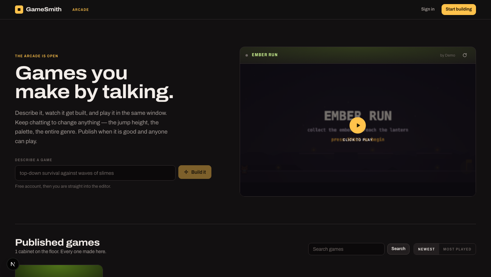
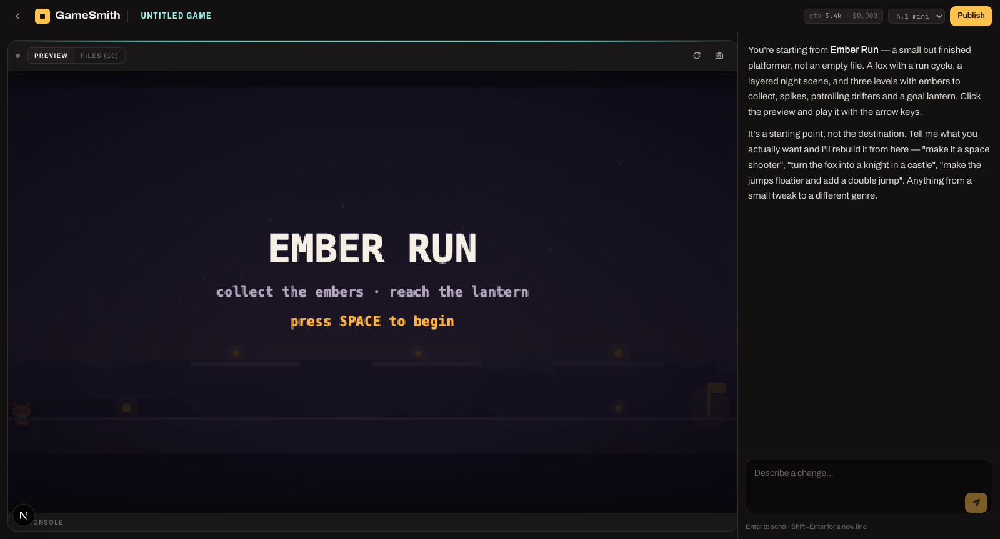
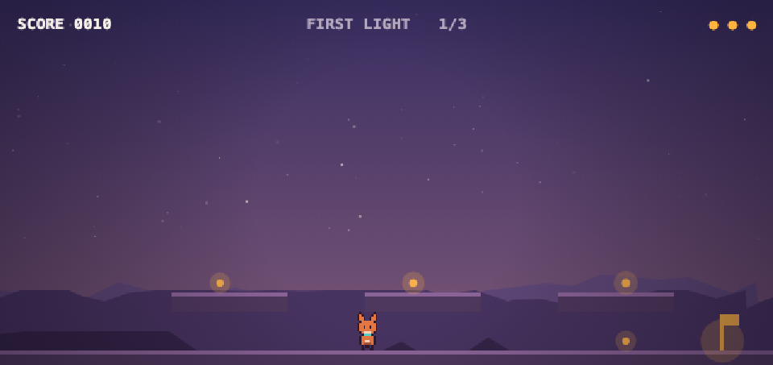

<div align="center">

# GameSmith

### Build playable 2D browser games by chatting with an AI

An open-source AI game studio in your browser. Describe a game, watch an agent write it,
play it in the same window, and publish it to a public arcade — no engine, no downloads,
no asset pipeline.

[](https://nextjs.org)
[](https://www.typescriptlang.org)
[](https://platform.openai.com)
[](https://nodejs.org/api/sqlite.html)
[](LICENSE)

</div>

---

<div align="center">
  
</div>

## What it does

You type *"a knight exploring a rain-soaked castle at dusk"*. An agent loads its game
design references, draws the knight with an image model, writes the physics, authors the
levels, **runs the game to check it works**, **screenshots it to check it looks right**,
and hands you something playable. You keep chatting to change anything — the jump height,
the palette, the entire genre.

Games are plain Canvas2D and ES modules. No build step, no bundler, no asset files.
Everything is drawn with code and synthesised with WebAudio, so a finished game is a
handful of small text files that run anywhere.

<table>
<tr>
<td width="50%"></td>
<td width="50%"></td>
</tr>
<tr>
<td align="center"><sub>The editor — live preview, chat rail, files and captured console</sub></td>
<td align="center"><sub>A game the agent built and playtested itself</sub></td>
</tr>
</table>

## Features

| | |
|---|---|
| 🎮 **Talk to build** | Describe a game in plain language and watch it appear in a live preview |
| 🧠 **15 built-in skills** | Game feel, platformer physics, character art, scene composition, level design, procedural audio, balance and more — loaded on demand |
| 🎨 **AI sprite generation** | Characters drawn by an image model, auto-outlined and reduced to a palette-limited pixel grid |
| 🧪 **It playtests itself** | Runs a simulated minute of play, unit-tests the collision, and checks the rules actually fire |
| 👀 **It looks at its own work** | Screenshots the running game in headless Chrome and critiques its own art |
| 📸 **Show, don't tell** | Paste a screenshot into the chat, or grab the live frame in one click, to point at a problem |
| 🕹️ **Public arcade** | Publish a game and anyone can play it, with saves and leaderboards |
| 💸 **Token-aware** | File manifests instead of file contents, truncated tool results, automatic context compaction, live cost readout |
| 🔒 **Sandboxed by design** | Games run on an opaque origin and can never touch your session |

## Quickstart

```bash
git clone https://github.com/AbdulHannan031/gamesmith-ai-game-generator.git
cd gamesmith-ai-game-generator
npm install
cp .env.example .env      # add your OpenAI API key
npm run dev               # http://localhost:3000
```

Requires **Node 22+** (for the built-in `node:sqlite`). There is no database to install
and nothing to compile — the SQLite file is created on first run.

Optionally install Chrome or Chromium to enable the `look` tool, which lets the agent
screenshot and critique its own games.

## How it works

### The agent

A tool-calling loop over `list_files`, `read_file`, `write_file`, `edit_file`,
`delete_file`, `load_skill`, `generate_sprite`, `playtest`, `look` and `set_meta`,
streamed to the editor over server-sent events.

### Skills

[`game-skills/`](game-skills) is a library of professional game development references
written as plain markdown. Only a one-line summary of each sits in the system prompt;
full bodies load on demand, so a 60-page library costs nothing until it is needed.

Edit the markdown to change how the agent designs games. No code changes required.

<details>
<summary><b>The 15 skills</b></summary>

`design-brief` · `game-feel` · `platformer-physics` · `topdown-action` · `grid-puzzle` ·
`character-art` · `procedural-art` · `scene-composition` · `procedural-audio` ·
`level-design` · `progression-balance` · `architecture` · `ui-hud` · `performance` ·
`shipping-complete`

</details>

### The starter toolkit

New projects are **empty games with a full toolkit** — a fixed-timestep loop, input,
substepped AABB tilemap collision, sprite baking, parallax scene helpers and WebAudio
synthesis — and no content. No character, no levels, no rules.

An earlier version shipped a complete game as the starter. It raised the quality floor
but caused convergence: every project became that game with a different character,
because rethemeing is easier than authoring. Shipping the machinery without the content
keeps the floor while leaving the game itself to be designed.

### Verification

The agent's claims are checked rather than trusted.

**Every write is validated before it is saved.** JavaScript is parsed, so a syntax error
never reaches disk. The module graph is resolved, catching imports that do not exist and
names a file never exports. Undefined identifiers are flagged — the dangling references a
partial refactor leaves behind. Sprite data is measured: a grid under 12×14, fewer than
four colours, or a single frame comes back as a specific complaint.

**`playtest` runs the game** for a simulated minute across four input strategies in a
child process against a stubbed DOM. It unit-tests `physics.js` directly — landing on a
floor, stopping at walls in both directions, being pushed out of a wall it overlaps, and
not tunnelling at speed. It reads a `state()` hook the game exposes and reports what never
happened: the score never moved, the player never took damage, the game never advanced
past level 1, the win state was never reached.

**`look` runs the game in real headless Chrome** and returns screenshots as image input,
so the agent can judge its own art and fix what is weak.

**Harness gates catch the rest.** Present a plan without building it and you get pushed
through. Rewrite rendering without reading the art references and you get sent back. Draw
characters as raw canvas shapes — provable, because `drawImage` is never called — and you
get sent back to generate real sprites.

### The game runtime

Games are served into an iframe sandboxed **without** `allow-same-origin`, giving them an
opaque origin. They can never read your cookies or call the API as you.

That also means `localStorage` throws inside a game, so persistence is bridged to the host
page:

```js
await GameSave.ready;
const best = GameSave.get("best", 0);
GameSave.set("best", score);              // server-backed when signed in
const board = await GameSave.submitScore(score);
```

Publishing snapshots the whole file tree, so editing a draft never breaks the version the
public is playing.

## Configuration

| Variable | Default | Purpose |
|---|---|---|
| `OPENAI_API_KEY` | — | **Required.** |
| `OPENAI_MODEL` | `gpt-5.1` | Model for new games, switchable per game |
| `OPENAI_REASONING` | `medium` | Reasoning effort for GPT-5 models |
| `OPENAI_IMAGE_MODEL` | `gpt-image-1-mini` | Sprite generation; needs transparency support |
| `COMPACT_AT` | `48000` | Context tokens before older turns are summarised |
| `KEEP_RECENT_TOKENS` | `14000` | Recent turns kept verbatim through a compaction |
| `MAX_AGENT_STEPS` | `48` | Tool calls allowed per turn |
| `DATA_DIR` | `./data` | Where the SQLite file lives |
| `CHROME_PATH` | auto | Browser used for screenshots |

## Project layout

```
game-skills/          the agent's reference library (markdown, editable)
scripts/playtest.mjs  headless play harness with the physics unit tests
src/app/              routes — pages, API, and the game file servers under /g
src/components/       editor shell, chat rail, game frame, cabinets
src/lib/
  agent.ts            tool loop, streaming, compaction, quality gates
  tools.ts            tool definitions and execution
  lint.ts             undefined-identifier and sprite-quality checks
  pixelize.ts         PNG decode/encode and image-to-pixel-grid conversion
  spritegen.ts        image model to authored sprite
  screenshot.ts       headless Chrome capture for the look tool
  playtest.ts         playtest orchestration and reporting
  prompt.ts           system prompt
  template.ts         the starter toolkit
  runtime.ts          in-frame harness: diagnostics, GameSave, screenshots
```

## Limitations

- Game quality tracks model strength, and the gap is large. `gpt-5.1` plans, loads the
  right references and edits surgically. The 4.x models are cheaper and fine for tweaks,
  but on a from-scratch build they tend to rewrite files and chase errors one at a time.
- The playtest drives a keyboard, so it verifies keyboard games far better than
  mouse-driven ones.
- Single-node by design: SQLite on local disk, sessions in the same database.
- Games are code-only. There is no file upload, by deliberate design — everything is
  drawn and synthesised.

## Contributing

Issues and pull requests are welcome. The most valuable contributions are new entries in
[`game-skills/`](game-skills) — they change how every game gets built, and they are just
markdown.

## License

[MIT](LICENSE) © Abdul Hannan
